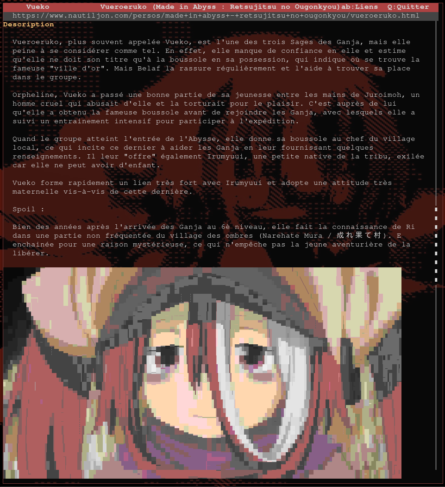

# 🌐 Vueko — Navigateur web terminal

> Navigateur web complet dans le terminal — rendu HTML, images via `chafa`, lecture vidéo MP4, UI ncurses.



---

## Fonctionnalités

- **Recherche Bing** directement depuis le terminal
- **Rendu HTML** : titres, liens, texte wrappé, séparateurs
- **Images** affichées en art ASCII/ANSI via `chafa`, proportionnelles à leur taille originale
- **Vidéos** jouées en GIF animé (chafa) + audio (mpg123) simultanément
- **Navigation** par liens avec Tab, scrollbar intégrée
- **UI ncurses** complète : barre d'adresse, barre de statut, scrollbar

---

## Prérequis

### Paquets système

**Arch / Manjaro**
```sh
pacman -S chafa ffmpeg json-c ncurses mpg123
```

**Debian / Ubuntu**
```sh
apt install chafa ffmpeg libjson-c-dev libncurses-dev mpg123
```

### Dépendances Python
```sh
pip install playwright requests filetype beautifulsoup4 --break-system-packages
playwright install chromium
```

---

## Compilation & lancement

```sh
make all        # compile browser, convert, play
make dirs       # crée datas/cache, datas/images, datas/videos
./browser       # lance le navigateur
```

Ou en une commande :
```sh
make all dirs && ./browser
```

---

## Raccourcis clavier

| Touche       | Action                                      |
|--------------|---------------------------------------------|
| `Ctrl+R`     | Nouvelle recherche ou saisie d'URL          |
| `↑` / `↓`   | Naviguer entre résultats / scroller la page |
| `PgUp / PgDn`| Défilement rapide (×10 lignes)              |
| `Entrée`     | Ouvrir le résultat sélectionné / suivre un lien |
| `Tab`        | Lien suivant (scroll automatique)           |
| `B`          | Retour à la liste des résultats             |
| `Q` / `ESC`  | Quitter                                     |

---

## Architecture

```
vueko/
│
├── browser.c       — UI ncurses principale
├── render.py       — Convertit temp.html → page.json
├── GET.py          — Télécharge page HTML + images + vidéos (Playwright)
├── search.py       — Recherche Bing → search_results.json
├── convert.c       — Convertit MP4 → GIF + MP3
├── play.c          — Joue GIF + MP3 simultanément
├── help.c          — Aide (--help)
├── main.c          — Point d'entrée CLI
├── Makefile
│
└── datas/
    ├── cache/
    │   ├── search_results.json   — Résultats de recherche Bing
    │   ├── temp.html             — HTML brut de la page courante
    │   ├── page.json             — Page rendue (lignes + liens + images)
    │   └── imgmap.json           — Correspondance URL → fichier image local
    ├── images/                   — Images téléchargées (img001.jpg, ...)
    └── videos/                   — Vidéos téléchargées (vid0.mp4, ...)
```

---

## Détail des composants

### `browser.c` — UI ncurses

Fenêtre principale en 4 zones :

```
┌─────────────────────────────────────────┐
│  TOP BAR    : titre + raccourcis        │  ligne 0
│  ADDR BAR   : URL courante              │  ligne 1
│                                         │
│  CONTENT    : résultats / page rendue   │  lignes 2..H-2
│                                         │
│  STATUS BAR : nb lignes, liens, scroll% │  ligne H-1
└─────────────────────────────────────────┘
```

**Modes :**
- `MODE_SEARCH` : affiche les résultats Bing (titre + URL, 3 lignes par résultat)
- `MODE_PAGE` : affiche la page rendue avec images et liens

**Gestion des images :**
- `draw_page()` réserve l'espace exact (en lignes ncurses) pour chaque image
- `draw_images_overlay()` appelle `chafa` et écrit les séquences ANSI par-dessus ncurses
- Les deux fonctions utilisent `img_real_h[]` — la hauteur réellement rendue par chafa — comme source de vérité unique pour éviter tout désynchronisation
- La scrollbar (dernière colonne) est préservée : chafa est contraint à `width - 3` colonnes

**Scrollbar :**
Dessinée en colonne `width - 1`, proportionnelle à la position dans la page.

---

### `render.py` — Convertisseur HTML → JSON

Lit `datas/cache/temp.html`, produit `datas/cache/page.json`.

```sh
python3 render.py --width=120            # rendu texte seul
python3 render.py --width=120 --images   # télécharge aussi les images
```

**Format de sortie `page.json` :**

```json
{
  "lines": [
    "##H1 Titre principal",
    "##H2 Sous-titre",
    "##HR",
    "Texte normal wrappé sur la largeur...",
    "##LK Texte du lien",
    "##IM datas/images/img001.jpg|label|800|600",
    "##VD ▶  Vidéo disponible"
  ],
  "links": [
    { "text": "Texte du lien", "url": "https://...", "line": 12 }
  ]
}
```

**Préfixes de ligne :**

| Préfixe  | Description                              | Rendu dans browser.c         |
|----------|------------------------------------------|------------------------------|
| `##H1 `  | Titre niveau 1                           | Jaune, gras, souligné        |
| `##H2 `  | Titre niveau 2                           | Jaune, gras                  |
| `##H3 `  | Titre niveau 3                           | Jaune, gras                  |
| `##LK `  | Lien hypertexte cliquable                | Cyan souligné (bleu surligné si sélectionné) |
| `##IM `  | Image : `path\|label\|orig_w\|orig_h`   | Espace réservé + overlay chafa |
| `##VD `  | Badge vidéo                              | Fond magenta                 |
| `##HR`   | Séparateur horizontal                    | Ligne `─────`                |
| *(rien)* | Texte normal                             | Blanc sur fond noir          |

**Algorithme de matching images :**
`render.py` maintient un `imgmap.json` qui associe chaque URL d'image à son fichier local. La correspondance se fait en cascade : URL exacte → sans query string → par suffixe de chemin → sans scheme. Les images dans `<a></a>` et dans les `<table>` sont correctement capturées.

---

### `GET.py` — Téléchargeur Playwright

Ouvre la page avec Chromium headless, récupère :
- Le HTML rendu (`temp.html`)
- Toutes les images visibles (jusqu'à 100), avec leurs `src`, `data-src` et `currentSrc`
- Les vidéos MP4 détectées

```sh
python3 GET.py "https://exemple.com"
```

Produit `datas/cache/temp.html`, `datas/cache/imgmap.json`, et remplit `datas/images/`.

---

### `convert.c` — Convertisseur vidéo

Convertit un fichier MP4 en GIF animé + MP3 audio via `ffmpeg`.

```sh
./convert "datas/videos/vid0.mp4"
# → datas/videos/vid0.gif
# → datas/videos/vid0.mp3
```

---

### `play.c` — Lecteur vidéo terminal

Joue un GIF (via `chafa`) et un MP3 (via `mpg123`) en parallèle dans le terminal.

```sh
./play "datas/videos/vid0.gif" "datas/videos/vid0.mp3"
```

---

### `search.py` — Recherche Bing

Effectue une recherche Bing et enregistre les résultats.

```sh
python3 search.py "made in abyss saison 3"
# → datas/cache/search_results.json
```

Format de sortie :
```json
[
  { "title": "...", "url": "https://...", "site": "exemple.com" }
]
```

---

## Flux complet d'une navigation

```
Ctrl+R → saisie requête
    └→ search.py → search_results.json
         └→ affichage MODE_SEARCH (browser.c)
              └→ Entrée sur un résultat
                   └→ GET.py → temp.html + images
                        └→ render.py → page.json
                             └→ affichage MODE_PAGE (browser.c)
                                  └→ render.py --images → chafa overlay
```

---

## Variables de configuration

| Variable dans le code     | Fichier      | Valeur par défaut | Description                        |
|---------------------------|--------------|-------------------|------------------------------------|
| `halfdelay(5)`            | `browser.c`  | 500ms             | Polling rate (dixièmes de seconde) |
| `img_w = width - 3`       | `browser.c`  | terminal - 3      | Largeur max des images             |
| `MAX_LINES 8192`          | `browser.c`  | 8192              | Nb max de lignes par page          |
| `MAX_LINKS 1024`          | `browser.c`  | 1024              | Nb max de liens par page           |
| `IMG_CACHE_LINES 256`     | `browser.c`  | 256               | Nb max de lignes ANSI en cache     |
| `limit=100` (GET.py)      | `GET.py`     | 100               | Nb max d'images téléchargées       |

---

## Dépannage

**Les images ne s'affichent pas**
- Vérifier que `chafa` est installé : `chafa --version`
- Vérifier que `datas/images/` contient des fichiers après navigation
- Consulter `/tmp/vueko.log` pour les erreurs de render

**Erreur de compilation**
```sh
# Vérifier les librairies
pkg-config --libs ncurses json-c
# Si json-c manque sur Debian :
apt install libjson-c-dev
```

**Playwright ne trouve pas Chromium**
```sh
python3 -m playwright install chromium
```

**La vidéo joue sans son**
- Vérifier `mpg123` : `which mpg123`
- Sur Arch : `pacman -S mpg123`

---

## Licence

Projet personnel — libre d'utilisation et de modification.
